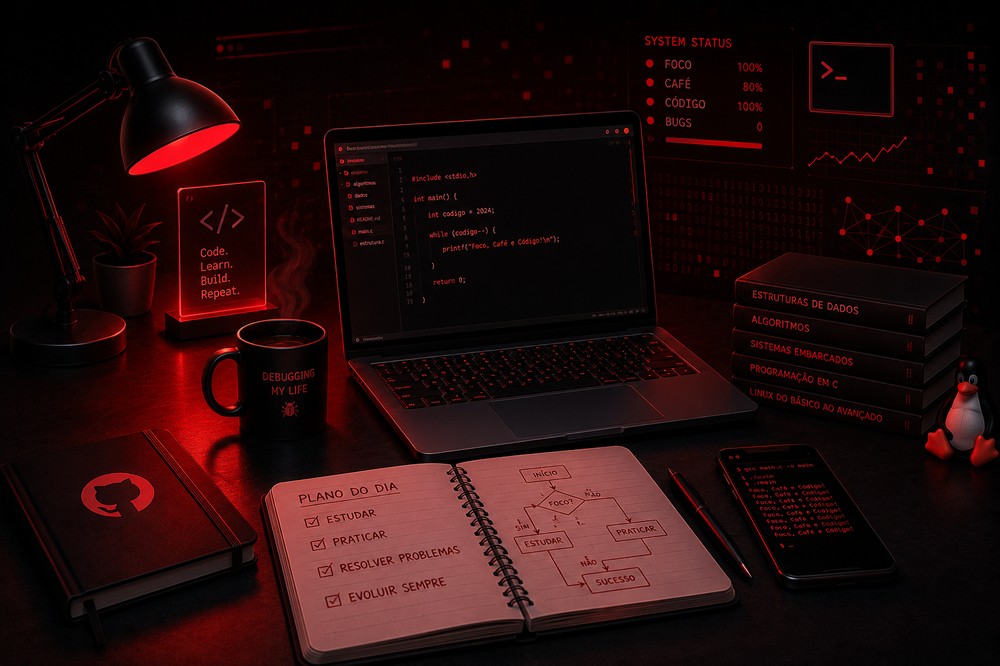

  

---
# 👨‍💻 Olá, eu sou o Fábio Rodrigues Borges Filho!

Seja bem-vindo(a) ao meu perfil no GitHub! Sou estudante de **Engenharia de Computação** na **Universidade Federal do Ceará (UFC) – Campus Quixadá**.

Minha trajetória é movida pela curiosidade de entender como as coisas funcionam, desde os níveis mais profundos do hardware até a experiência do usuário na ponta final. Atualmente, foco meus esforços em duas grandes frentes:

*   **Sistemas Embarcados & Baixo Nível:** Desenvolvimento de firmware, drivers Linux e arquitetura de processadores. Adoro o desafio de otimizar código para recursos limitados.
*   **Desenvolvimento Web & Frontend:** Aplicação de tecnologias modernas para criar interfaces responsivas e funcionais, buscando conectar o poder do hardware com soluções web acessíveis.

---

### 🛠️ Tecnologias e Ferramentas

**Linguagens e Desenvolvimento:**

  

**Design e Hardware:**

  
  
  
  

---

### 🚀 Projetos em Destaque

- 🎮 **[BBB-Jokenpo](https://github.com/F4BINH00/BBB-Jokenpo)**  
  Projeto final de Sistemas Embarcados desenvolvido em Bare-Metal para a BeagleBone Black.

- 🔭 **[Newton-CV](https://github.com/F4BINH00/Newton-CV)**  
  Aplicação de Visão Computacional para análise cinemática utilizando Python e OpenCV.

- ⚙️ **[TPSE1-UFC](https://github.com/F4BINH00/TPSE1-UFC)**  
  Repositório com todas as práticas de Técnicas de Programação para Sistemas Embarcados I.

- 💻 **[Pico_USB](https://github.com/F4BINH00/pico-usb-driver)**  
  Driver Linux e firmware para Raspberry Pi Pico com comunicação Kernel ↔ Usuário.

- ♻️ **[Recicla Quixadá](Projeto de Extensão - Em desenvolvimento)**  
  Plataforma colaborativa que conecta cidadãos, catadores e pontos de coleta para promover a economia circular e a inclusão social em Quixadá.

---

### 📊 Estatísticas do GitHub

---

### 📊 Gráfico de Atividades

---

### 📫 Entre em contato

Sinta-se à vontade para entrar em contato comigo para discutir projetos, tecnologia ou oportunidades:

*   **LinkedIn:** [fabio-r-b-filho](https://www.linkedin.com/in/fabio-r-b-filho/)
*   **Email:** [fabiorbfilho@alu.ufc.br](mailto:fabiorbfilho@alu.ufc.br)

---

### 🎓 Acadêmico
*   **Curso:** Engenharia de Computação.
*   **Universidade:** Universidade Federal do Ceará - Campus Quixadá.
